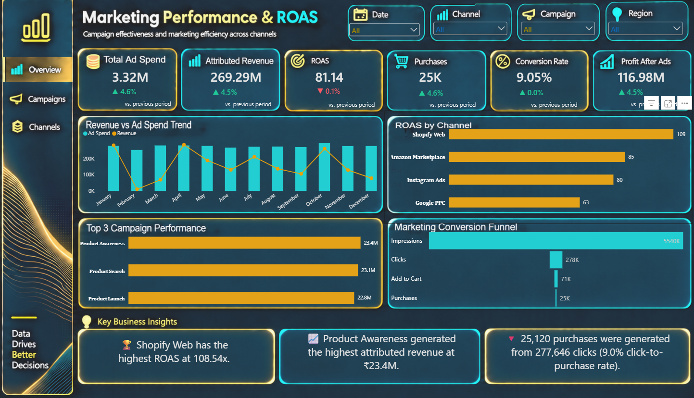

# 📈 Marketing ROAS & Campaign Performance Dashboard \| Power BI

An interactive Business Intelligence dashboard built with **Power BI,
Power Query, and DAX** to analyze marketing performance, advertising
efficiency, campaign returns, customer conversion, and profitability
across multiple marketing channels.

------------------------------------------------------------------------

## 📌 Executive Summary

This project transforms marketing and campaign performance data into an
interactive dashboard for evaluating advertising efficiency and campaign
effectiveness.

The dashboard brings together:

-   💰 Attributed revenue and advertising spend
-   📈 Return on Ad Spend (ROAS)
-   🛒 Purchase and conversion performance
-   📣 Campaign and marketing channel analysis
-   🔻 Marketing conversion funnel performance
-   💵 Profit after advertising costs
-   📊 Dynamic KPI and performance comparisons

The goal was to create a dashboard that helps users compare marketing
performance, identify high-performing channels and campaigns, and
understand where advertising spend is generating returns.

------------------------------------------------------------------------

## 🎯 Business Problem

Marketing performance can be difficult to evaluate when advertising
spend, revenue, campaign activity, and customer conversion metrics are
viewed separately.

This project brings key marketing KPIs into a single interactive
dashboard.

The dashboard helps answer questions such as:

-   Which marketing channels generate the strongest ROAS?
-   Which campaigns contribute the highest attributed revenue?
-   How does advertising spend compare with generated revenue over time?
-   Where are customers dropping off in the marketing funnel?
-   Which campaigns generate more purchases from their traffic?
-   How much profit remains after advertising costs?

------------------------------------------------------------------------

## ⚙️ Methodology

### 1️⃣ Data Preparation & Cleaning

The dataset was prepared for analysis using **Power Query in Power BI**.

Key preparation steps included:

-   Reviewing and cleaning raw marketing and transaction data
-   Standardizing data types and field formats
-   Checking data quality and consistency
-   Preparing date and categorical fields for analysis
-   Structuring marketing, campaign, revenue, and funnel metrics for
    reporting

### 2️⃣ Data Modeling & DAX

Power BI was used to build the analytical model and create dynamic DAX
measures.

Key measures include:

-   Total Ad Spend
-   Attributed Revenue
-   ROAS
-   Total Purchases
-   Conversion Rate
-   Profit After Ads
-   Previous Month KPI values
-   KPI Change %
-   Dynamic performance indicators
-   Campaign and channel ranking measures

A dedicated calendar table was created to support time-based analysis
and month-over-month KPI comparisons.

### 3️⃣ Dashboard Design

The dashboard uses a dark, modern interface focused on readability and
business usability.

The final interface includes:

-   KPI cards with dynamic performance indicators
-   Revenue vs. Ad Spend trend analysis
-   Channel-level ROAS comparison
-   Top campaign performance analysis
-   Marketing conversion funnel
-   Interactive filtering
-   Dynamic business insights

------------------------------------------------------------------------

## 📊 Dashboard Features

### KPI Overview

The dashboard tracks six key marketing indicators:

| **KPI** | **Purpose** |
|---|---|
| 💰 **Total Ad Spend** | Monitor advertising investment |
| 📈 **Attributed Revenue** | Track revenue attributed to marketing activity |
| 🎯 **ROAS** | Measure advertising return relative to spend |
| 🛒 **Total Purchases** | Monitor purchase volume |
| 🔄 **Conversion Rate** | Measure click-to-purchase conversion |
| 💵 **Profit After Ads** | Evaluate profitability after advertising costs |

  -----------------------------------------------------------------------

### Visual Analytics

**Revenue vs. Ad Spend Trend**\
Monthly comparison of advertising spend and attributed revenue to
understand marketing performance over time.

**ROAS by Channel**\
Comparison of advertising efficiency across marketing channels based on
return generated for each unit of ad spend.

**Top 5 Campaign Performance**\
Identifies the campaigns generating the highest attributed revenue, with
supporting spend, ROAS, and purchase metrics.

**Marketing Conversion Funnel**\
Tracks the customer journey from impressions to clicks, add-to-cart
activity, and purchases.

### Interactive Controls

-   📅 Date filtering
-   📣 Marketing channel filtering
-   🎯 Campaign filtering
-   🌍 Region filtering

The dashboard updates KPIs, charts, and business insights dynamically
based on the selected filters.

------------------------------------------------------------------------

## 🛠️ Tools & Skills

### Tools

-   **Power BI Desktop**
-   **Power Query**
-   **DAX**
-   **Canva**

### Technical Skills

-   Data Cleaning & Transformation
-   Power Query
-   Data Modeling
-   DAX Measures
-   Time Intelligence
-   KPI Development
-   Marketing Analytics
-   ROAS Analysis
-   Campaign Performance Analysis
-   Funnel Analysis
-   Data Visualization
-   Dashboard Design
-   Business Analysis

------------------------------------------------------------------------

## 📈 Key Insights

The dashboard provides several marketing performance insights,
including:

-   **₹269M+ attributed revenue** analyzed across the dataset.
-   **₹3.3M+ advertising spend** analyzed across marketing activity.
-   Marketing performance was evaluated across **4 marketing channels**.
-   Performance was analyzed across **12+ campaigns**.
-   Channel-level analysis highlights differences in advertising
    efficiency and ROAS.
-   Campaign-level analysis helps identify campaigns generating higher
    attributed revenue.
-   Funnel analysis provides visibility into the movement from
    impressions and clicks to purchases.
-   Profit-after-ads analysis provides an additional view of marketing
    performance beyond revenue and ROAS alone.

------------------------------------------------------------------------

## 💡 Business Recommendations

Based on the dashboard analysis:

-   Prioritize channels and campaigns demonstrating stronger ROAS.
-   Review high-spend campaigns that generate comparatively lower
    returns.
-   Monitor conversion drop-offs between clicks, add-to-cart activity,
    and purchases.
-   Evaluate campaign performance using both revenue and
    profit-after-ads rather than revenue alone.
-   Use dynamic KPI comparisons to identify month-over-month performance
    changes.
-   Reallocate advertising investment toward campaigns with stronger
    overall efficiency and profitability.

------------------------------------------------------------------------

## 🚀 Future Improvements

Potential extensions for the project include:

- 🔮 Campaign performance forecasting
- 🤖 Predictive conversion and ROAS modeling
- 📊 Customer-level marketing segmentation
- 🔎 Multi-page campaign drill-through analysis
- 📊 Advanced campaign attribution analysis
- 📈 Automated data refresh and reporting pipelines
- 🎯 Budget allocation and campaign optimization analysis

------------------------------------------------------------------------

## 📷 Dashboard Preview

------------------------------------------------------------------------

## 📥 Power BI Project File

The repository includes the Power BI project file:

[Download the Power BI Project
(.pbix)](ROAS_dashboard.pbix)

Open the file using **Power BI Desktop** to explore the dashboard, DAX
measures, data model, and interactive filters.

------------------------------------------------------------------------

## 🙌 Conclusion

This project demonstrates my ability to transform marketing and campaign
data into an interactive Business Intelligence solution using **Power
BI, Power Query, and DAX**.

The project strengthened my practical skills in:

**Data Cleaning → Data Modeling → DAX → Time Intelligence →
Visualization → Marketing Insights**

More importantly, it demonstrates how a dashboard can connect
advertising spend, revenue, conversion, campaign performance, and
profitability to support better marketing decisions.

------------------------------------------------------------------------

### 👤 Project Focus

**Marketing Analytics \| ROAS Analysis \| Campaign Performance \|
Conversion Funnel \| Business Intelligence \| Power BI**

## About

Power BI Marketing ROAS & Campaign Performance dashboard built using
Power Query, DAX, and Canva. Analyzes attributed revenue, advertising
spend, ROAS, campaign performance, conversion funnel metrics, and profit
after ads.
